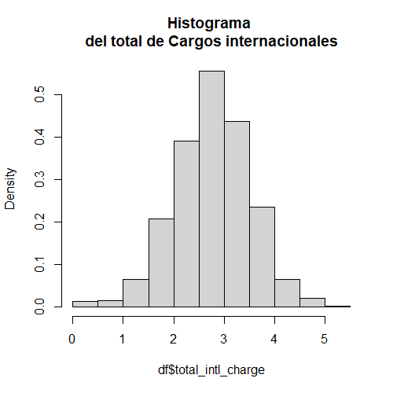
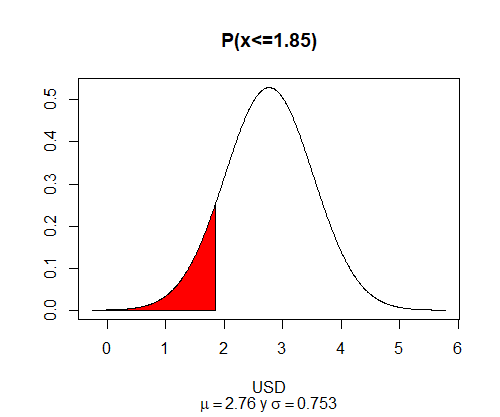
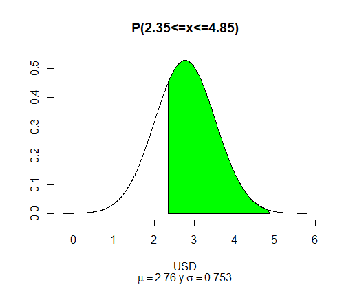
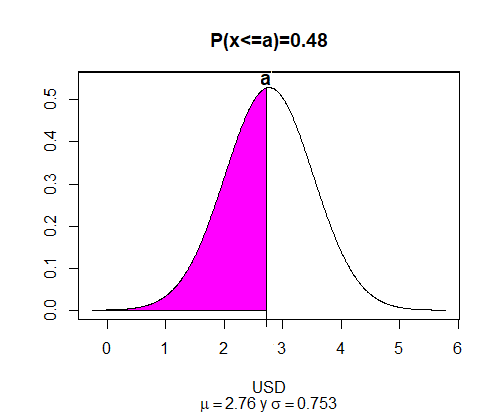
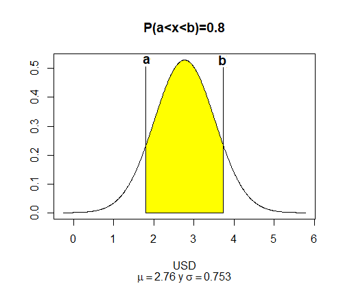

# Postwork Sesión 4
# Objetivo
- Realizar un análisis probabilístico del total de cargos internacionales de una compañía de telecomunicaciones
# Requisitos
- R, RStudio
- Haber trabajado con el prework y el work
# Desarrollo
Utilizando la variable `total_intl_charge` de la base de datos `telecom_service.csv` de la sesión 3, realiza un análisis probabilístico. Para ello, debes determinar la función de distribución de probabilidad que más se acerque el comportamiento de los datos. Hint: Puedes apoyarte de medidas descriptivas o técnicas de visualización.
```R
df <- read.csv("https://raw.githubusercontent.com/beduExpert/Programacion-R-Santander-2022/main/Sesion-03/Data/telecom_service.csv")
library(DescTools) #Mode
total_intl_charge <-df$total_intl_charge
promedio <-mean(total_intl_charge)
moda <- Mode(total_intl_charge)
mediana <-median(total_intl_charge)
desv <- sd(total_intl_charge)
hist(df$total_intl_charge, prob=T, main="Histograma \ndel total de Cargos internacionales")
```
Salida
> Promedio = 2.7645  
Mediana = 2.78  
Desviación estandar= 0.7537  



> **Conclusión**  
> El histograma tiene un comportamiento al de una distribución normal.
### Analisis probabilistico
Una vez que hayas seleccionado el modelo, realiza lo siguiente:

**1.** Grafica la distribución teórica de la variable aleatoria `total_intl_charge`
```R 
curve(dnorm(x, mean = promedio, sd = desv), from=0, to=5, col='blue', main = "Distribución \n teórica", ylab = "f(x)", xlab = "X")
```


**2.** ¿Cuál es la probabilidad de que el total de cargos internacionales sea menor a 1.85 usd?
```R 
pnorm(q = 1.85, mean = promedio, sd = desv, lower.tail = TRUE)
```
Resultado
```
0.1125002
```
> La probabilidad de que el total de cargos internacionales sea menor a 1.85 usd es del `11.25 %`



**3.** ¿Cuál es la probabilidad de que el total de cargos internacionales sea mayor a 3 usd?
```R 
pnorm(q = 3, mean = promedio, sd = desv, lower.tail = FALSE)
```
Resultado
```
0.3773985
```
> La probabilidad de que el total de cargos internacionales sea mayor a 3 usd es del `37.74 %`


**4.** ¿Cuál es la probabilidad de que el total de cargos internacionales esté entre 2.35usd y 4.85 usd?
```R 
pnorm(q = 1.85, mean = promedio, sd = desv, lower.tail = TRUE)
```

Resultado
```
0.7060114
```
> La probabilidad de que el total de cargos internacionales esté entre 2.35usd y 4.85 usd es del 70.60 %



**5.** Con una probabilidad de 0.48, ¿cuál es el total de cargos internacionales más alto que podría esperar?
```R 
c <- qnorm(p = 0.48, mean = promedio, sd = desv)
c
```
Resultado
```
2.726777
```
> Con una probabilidad de 0.48, el total de cargos internacionales más alto que podría esperar es de `2.72 USD`



**6.** ¿Cuáles son los valores del total de cargos internacionales que dejan exactamente al centro el 80% de probabilidad?
```R 
a<-qnorm(p = 0.10, mean = promedio, sd = desv); b<-qnorm(p = 0.90, mean = promedio, sd = desv)
a;b
```
Resultado
```
[1] 1.798583
[1] 3.73058
```
> Los valores del total de cargos internacionales que dejan exactamente al centro el 80% de probabilidad, son `a= 1.79 USD` y `b= 3.73 USD`


