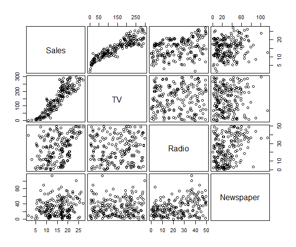
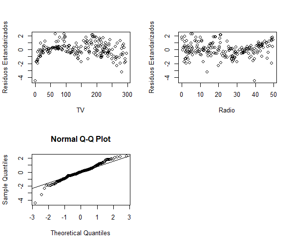

# Postwork Sesión 6.

## Desarrollo

Supongamos que nuestro trabajo consiste en aconsejar a un cliente sobre como mejorar las ventas de un producto particular, y el conjunto de datos con el que disponemos son datos de publicidad que consisten en las ventas de aquel producto en 200 diferentes mercados, junto con presupuestos de publicidad para el producto en cada uno de aquellos mercados para tres medios de comunicación diferentes: TV, radio, y periódico. No es posible para nuestro cliente incrementar directamente las ventas del producto. Por otro lado, ellos pueden controlar el gasto en publicidad para cada uno de los tres medios de comunicación. Por lo tanto, si determinamos que hay una asociación entre publicidad y ventas, entonces podemos instruir a nuestro cliente para que ajuste los presupuestos de publicidad, y así indirectamente incrementar las ventas.

En otras palabras, nuestro objetivo es desarrollar un modelo preciso que pueda ser usado para predecir las ventas sobre la base de los tres presupuestos de medios de comunicación. Ajuste modelos de regresión lineal múltiple a los datos advertisement.csv y elija el modelo más adecuado siguiendo los procedimientos vistos

Considera:

- Y: Sales (Ventas de un producto)
- X1: TV (Presupuesto de publicidad en TV para el producto)
- X2: Radio (Presupuesto de publicidad en Radio para el producto)
- X3: Newspaper (Presupuesto de publicidad en Periódico para el producto)
```
adv <- read.csv("https://raw.githubusercontent.com/beduExpert/Programacion-R-Santander-2022/main/Sesion-06/data/advertising.csv")
```
### Generación de una matriz de correlación
```R
adv.select <- select(adv, Sales,TV, Radio, Newspaper)
round(cor(adv.select),4)
```
> La tabla muestra que existe una correlación positiva fuerte entre Ventas y TV (0.9012)

```R
"Sales     TV  Radio Newspaper
Sales     1.0000 0.9012 0.3496    0.1580
TV        0.9012 1.0000 0.0548    0.0566
Radio     0.3496 0.0548 1.0000    0.3541
Newspaper 0.1580 0.0566 0.3541    1.0000"
```

> Una correlación positiva débil entre ventas y radio (0.3496)  
> También una correlación positiva débil entre ventas y periodico (0.1580)

A continuación se genera una matriz de dispersión relacionando las variables a través de ~

```R
pairs(~ Sales + TV + Radio + Newspaper, 
      data = adv, gap = 0.4, cex.labels = 1.5)
```

> Con base a la matriz anterior se observa la correlación fuerte entre Ventas y TV y una asociación positiva entre Sales y las demás variables

### Estimación por Mínimos Cuadrados Ordinarios (OLS) (0,1,2,3)
Calcular los coeficientes de regresión beta
```R
Sales = beta0 + beta1*TV + beta2*Radio + beta3*Newspaper + e"
attach(adv) #enmascara las variables para llamarlas internamente
modelo1 <- lm(adv$Sales ~ TV + Radio + Newspaper)
summary(modelo1)
```

> Con baser a la tabla se tiene R2 múltiple de 0.9026 (muy alto si se considera que debe estar entre 0 y 1)
```
Residuals:
    Min      1Q  Median      3Q     Max 
-7.3034 -0.8244 -0.0008  0.8976  3.7473 
Coefficients:
             Estimate Std. Error t value Pr(>|t|)    
(Intercept) 4.6251241  0.3075012  15.041   <2e-16 ***
TV          0.0544458  0.0013752  39.592   <2e-16 ***
Radio       0.1070012  0.0084896  12.604   <2e-16 ***
Newspaper   0.0003357  0.0057881   0.058    0.954    
---
Signif. codes:  0 ‘***’ 0.001 ‘**’ 0.01 ‘*’ 0.05 ‘.’ 0.1 ‘ ’ 1
Residual standard error: 1.662 on 196 degrees of freedom
Multiple R-squared:  0.9026,	Adjusted R-squared:  0.9011 
F-statistic: 605.4 on 3 and 196 DF,  p-value: < 2.2e-16
```
> Puede significar un problema en el modelo
### Análisis de las variables explicativas
Son efectos marginales los coeficientes como cambia la variable dependiente a variaciones unitarias eb la variable independiente por cada incremento unitario en TV las ventas se incrementan 0.054 por cada se observa que Radio tiene un incremento unitario mayor, es decir por cada incremento de Redio se tiene 0.1 incremento en las ventas, es el dato más significativo se concluye que Newspaper no es significativo (valor 0.0003357) se tienen que establecer hipótesis para demostrar los efectos en la población, por lo tanto, se establecen las dos hipótesis:
> Ho:beta_i=0  
> Ha:beta_i!=0

Con base al análisis de los pValue y con un nivel de confianza del 95% con una significancia estadística de 0.05 se tiene o concluye que Newspaper no ayuda a explicar el comportamiento de las ventas, (pvalue es de 0.954)  
Tal como lo muestra la siguiente tabla
```
Coefficients:
  Estimate Std. Error t value Pr(>|t|)    
(Intercept) 4.6251241  0.3075012  15.041   <2e-16 ***
  TV          0.0544458  0.0013752  39.592   <2e-16 ***
  Radio       0.1070012  0.0084896  12.604   <2e-16 ***
  Newspaper   0.0003357  0.0057881   0.058    0.954    
---
  Signif. codes:  0 ‘***’ 0.001 ‘**’ 0.01 ‘*’ 0.05 ‘.’ 0.1 ‘ ’ 1"
```

Ahora se va a revisar un nuevo modelo con una actualización del anterior por medio del comando update eliminando Newspaper

```R
modelo2 <- lm(adv$Sales ~ TV + Radio ) # se está utilizando esta instrucción porque la que usa update marca error
#modelo2 <- update(modelo1 ~.-Newspaper) Marca error!! 

summary(modelo2)
```

Mostrando la siguiente tabla:
```R
Residuals:
    Min      1Q  Median      3Q     Max 
-7.3131 -0.8269  0.0095  0.9022  3.7484 
Coefficients:
            Estimate Std. Error t value Pr(>|t|)    
(Intercept) 4.630879   0.290308   15.95   <2e-16 ***
TV          0.054449   0.001371   39.73   <2e-16 ***
Radio       0.107175   0.007926   13.52   <2e-16 ***
---
Signif. codes:  0 ‘***’ 0.001 ‘**’ 0.01 ‘*’ 0.05 ‘.’ 0.1 ‘ ’ 1
Residual standard error: 1.657 on 197 degrees of freedom
Multiple R-squared:  0.9026,	Adjusted R-squared:  0.9016 
F-statistic: 912.7 on 2 and 197 DF,  p-value: < 2.2e-16
``` 
> Se debe comparar el R2 ajustado para la comparación de los 2 modelos la diferencia es mínima entre ambos modelos (modelo1=0.9011 y modelo2=0.9016), aún así se puede tomar en cuenta el modelo 1  
> Cómo no hay variables dicotómicas no se pueden establecer términos de iteración

### Estimación de los residuos estandarizados
```R
resEstandarizados <- rstandard(modelo2)
resEstandarizados

par(mfrow=c(2,2))

plot(TV, resEstandarizados, ylab= "Residuos Estandarizados") #Gráfica de TV vs residuos estandarizados
plot(Radio, resEstandarizados, ylab= "Residuos Estandarizados") #Gráfica de Redio vs residuos estandarizados
```

> Las gráficas muestran una alerta ya que los datos tienden a ser positivos concluyendo que se tiene un  mayor problema con TV  
> A continuación se grafica para comparar los quantiles de una distribución  normal con los quantiles de los  residuos
```R
qqnorm(resEstandarizados)
qqline(resEstandarizados)
```
> Se puede concluir que los residuos se comportan como una normal, la mayor parte de puntos coincide  entre -1 y 1 de desviación estándar
> Lo que sigues es verificar si esto ocurre en la población para esto se aplica la prueba de shapiro wilk

shapiro.test(resEstandarizados)

Las hipótesis a contrastar
> Ho: La variable distribuye como una normal  
> Ha: La variable NO distribuye como una normal

Resultado de la prueba de shapiro:
```
Shapiro-Wilk normality test
data:  resEstandarizados
W = 0.97535, p-value = 0.001365"
```

> Con el valor de pValue de 0.001365 se rechaza Ho por lo tanto no distribuye como una normal para una significancia de 0.1, 0.05 y 0.01 y no permite hacer predicciones  
> Como en el problema no se tienen variables categóricas no se usa un modelo de Regresión Logística

